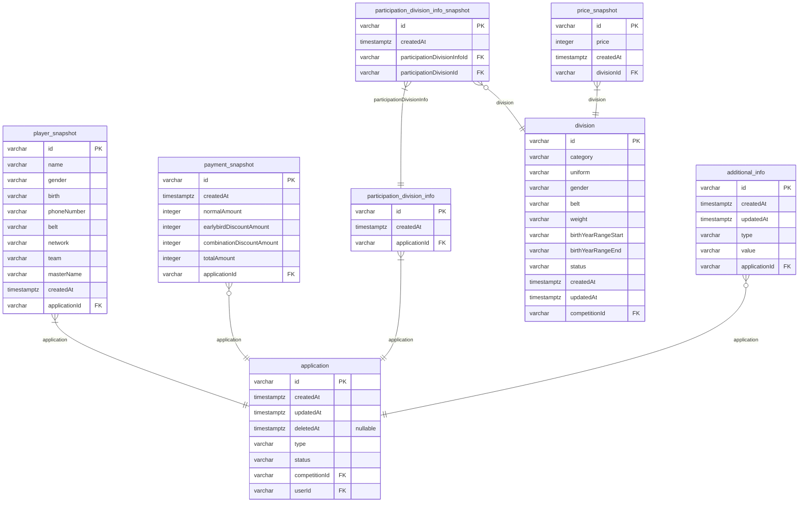

# 문제 상황

테스트를 위해 12만 개의 데이터를 생성 후, 신청 내역을 30개씩 가져오는 데 약300~400ms가 소요됨.

# 기존 쿼리 성능 (평균 약 359.212ms)
1. Query Application: 395.96ms
2. Query Application: 345.71ms
3. Query Application: 343.412ms
4. Query Application: 322.222ms
5. Query Application: 373.989ms
6. Query Application: 357.407ms
7. Query Application: 339.254ms
8. Query Application: 348.709ms
9. Query Application: 361.956ms
10. Query Application: 363.505ms

# 테스트 환경

- **장비**: M1 MacBook Air, RAM 16GB
- **기술 스택**: NestJS, TypeORM, PostgreSQL (Docker 사용)
- **데이터 갯수**:
  - UserEntity: 3
  - PolicyEntity: 4
  - CompetitionEntity: 1000
  - EarlybirdDiscountSnapshotEntity: 600
  - CombinationDiscountSnapshotEntity: 400
  - RequiredAdditionalInfoEntity: 400
  - CompetitionHostMapEntity: 2400
  - AdditionalInfoEntity: 60000
  - ==ApplicationEntity: 120000==
  - PlayerSnapshotEntity: 120000
  - ParticipationDivisionInfoEntity: 225600
  - ParticipationDivisionInfoSnapshotEntity: 225600
  - DivisionEntity: 362400
  - PriceSnapshotEntity: 362400
  
## Application ERD

# 인덱스 적용 (Application indexes)

| Table | Index Name | Columns | Unique | Spatial | Where |
|-------|-------------|---------|--------|---------|-----------|
| player_snapshot | IDX_PlayerSnapshot_applicationId | applicationId | false | false |  |
| participation_division_info_snapshot | IDX_ParticipationDivisionInfoSnapshot_participationDivisionInfoId | participationDivisionInfoId | false | false |  |
| participation_division_info | IDX_ParticipationDivisionInfo_applicationId | applicationId | false | false |  |
| price_snapshot | IDX_PriceSnapshot_divisionId | divisionId | false | false |  |
| division | IDX_Division_competitionId | competitionId | false | false |  |
| additional_info | IDX_AddtionalInfo_applicationId | applicationId | false | false |  |
| application | IDX_Application_userId_createdAt | userId, createdAt | false | false |  |

# 최적화 후 성능 (평균 약 44.199ms)

1. Query Application: 56.61ms
2. Query Application: 32.402ms
3. Query Application: 47.185ms
4. Query Application: 41.437ms
5. Query Application: 45.027ms
6. Query Application: 47.785ms
7. Query Application: 47.505ms
8. Query Application: 39.513ms
9. Query Application: 35.459ms
10. Query Application: 47.069ms

# 성능 개선 결과 (약 87.70% 개선)

- 개선 전 : 359.212ms 
- 개선 후 : 44.199ms

==약 **87.70%** 개선되었습니다.==

![[output.png]]