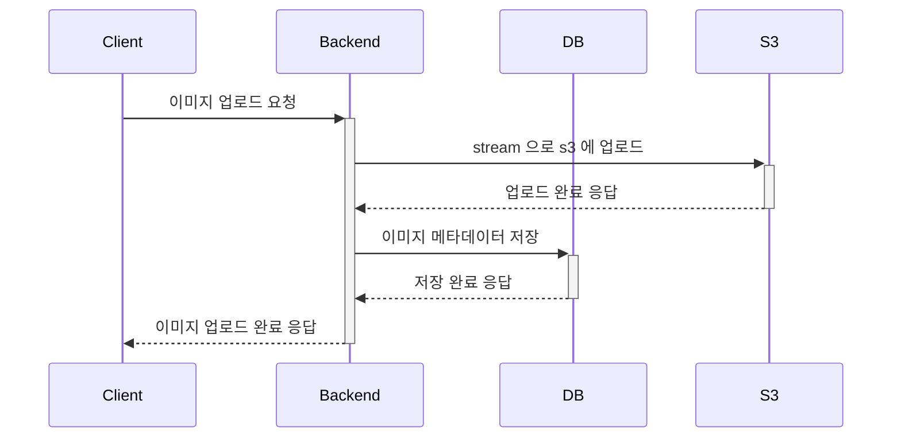
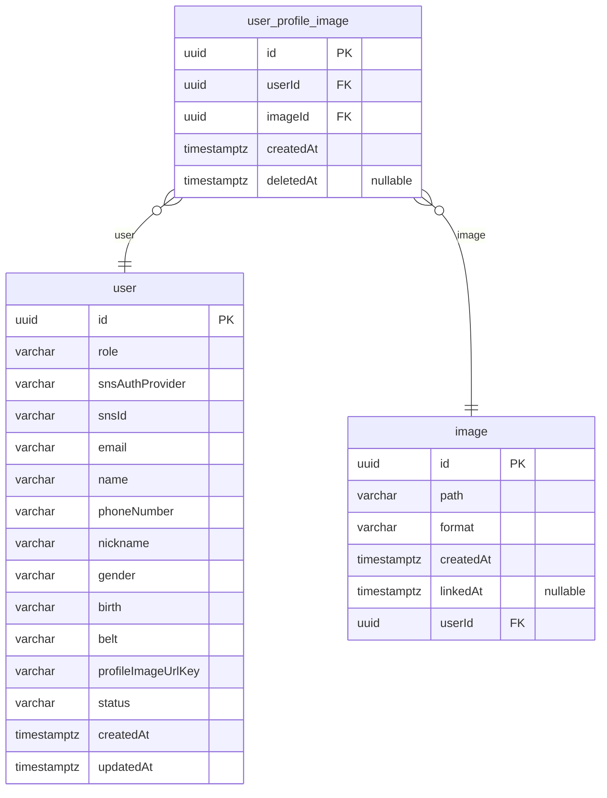
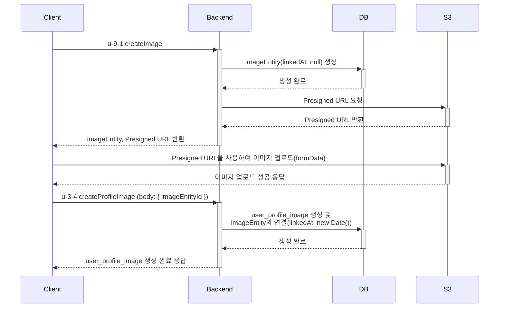

# V1 이미지 업로드 구조 (multer s3 streaming 방식)

V1에서는 이미지 업로드가 필요한 부분이 대회 포스터 기능 밖에 없었습니다. 대회 등록은 어드민만 가능하기 때문에, 동시에 여러 이미지를 업로드하는 시나리오가 없었습니다.




# V2 이미지 업로드 구조 (PresignedUrl 방식)

V2에서는 게시글 이미지, 유저 프로필 이미지 등 유저가 직접 이미지 업로드하는 기능이 필요하기 때문에, 동시에 이미지 업로드가 몰려서 백엔드 서버에 부하가 생길 가능성이 존재합니다.

V2 이미지 업로드 구조에서 `presignedUrl` 기능을 사용하여 클라이언트가 직접적으로 S3에 이미지를 업로드하도록 문제를 해결했습니다.






# 이미지 동시 업로드 부하 테스트

## 테스트 환경
- docker, docker-compse 로 AWS free tier 환경을 모방후 테스트를 진행했습니다.
```yml
version: '3.8'

services:
  app:
    build: .
    ports:
      - '${APP_PORT}:${APP_PORT}'
    environment:
      NODE_ENV: performance
      DB_PORT: ${DB_PORT}
      REDIS_PORT: ${REDIS_PORT}
      APP_PORT: ${APP_PORT}
    command: node --max-old-space-size=1024 dist/src/main.js # 힙 메모리 크기 증가 및 올바른 시작 파일 지정
    deploy:
      resources:
        limits:
          cpus: '1' # AWS Free Tier EC2 t2.micro 인스턴스 사양
          memory: 1G # AWS Free Tier EC2 t2.micro 인스턴스 사양
    depends_on:
      - postgres
      - redis
      - minio

  postgres:
    image: postgres
    ports:
      - '${DB_PORT}:5432'
    environment:
      POSTGRES_DB: ${DB_DATABASE}
      POSTGRES_USER: ${DB_USERNAME}
      POSTGRES_PASSWORD: ${DB_PASSWORD}
    volumes:
      - postgres_data:/var/lib/postgresql/data
    deploy:
      resources:
        limits:
          cpus: '1' # AWS Free Tier RDS db.t2.micro 인스턴스 사양
          memory: 1G # AWS Free Tier RDS db.t2.micro 인스턴스 사양

  redis:
    image: redis
    ports:
      - '${REDIS_PORT}:6379'
    volumes:
      - redis_data:/data
    deploy:
      resources:
        limits:
          cpus: '1' # AWS Free Tier Elasticache t2.micro 인스턴스 사양
          memory: 555M # AWS Free Tier Elasticache t2.micro 인스턴스 사양

  minio:
    image: quay.io/minio/minio
    environment:
      MINIO_ROOT_USER: minioadmin
      MINIO_ROOT_PASSWORD: minioadmin
    ports:
      - '${MINIO_PORT}:9000'
      - '${MINIO_CONSOLE_PORT}:9001'
    command: server /data --console-address ":${MINIO_CONSOLE_PORT}"
    volumes:
      - miniodata:/data

volumes:
  postgres_data:
  redis_data:
  miniodata:

```
	


## Multer s3 streaming 방식
- 5MB 이미지 200회 동시 업로드
- Total time for 200 uploads: 25.874 seconds
- Average time per upload: 0.129 seconds
- 300회 동시 요청시 서버 다운

## PresignedUrl 이미지 업로드 방식
- 5MB 이미지 200회 동시 업로드
- Total time for 200 uploads: 9.133 seconds
- Average time per upload: 0.045 seconds
- 1000회 동시 요청시에도 정상 동작


# 최종 결론
V2의 PresignedUrl 방식은 V1의 Multer S3 스트리밍 방식보다 성능 면에서 더 뛰어납니다. 이는 특히 동시에 많은 이미지 업로드 요청이 있을 때 명확하게 나타납니다. 

V1 방식은 200회 동시 업로드에서 평균 0.129초가 소요되며 300회 동시 업로드에서 서버가 다운되는 문제가 발생했습니다. 반면, V2 방식은 200회 동시 업로드에서 평균 0.045초가 소요되며 1000회 동시 업로드에서도 무난히 동작했습니다.
이를 통해 PresignedUrl 방식을 사용하여 클라이언트가 직접적으로 S3에 이미지를 업로드하는 것이 서버 부하를 줄이고 성능을 향상시키는 데 효과적임을 확인할 수 있습니다.
