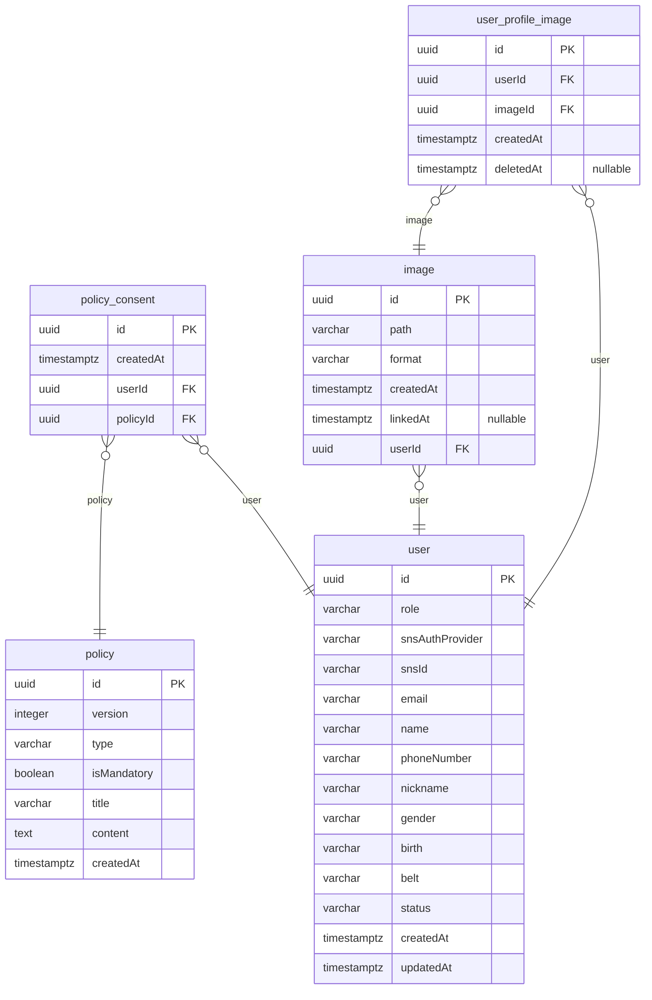
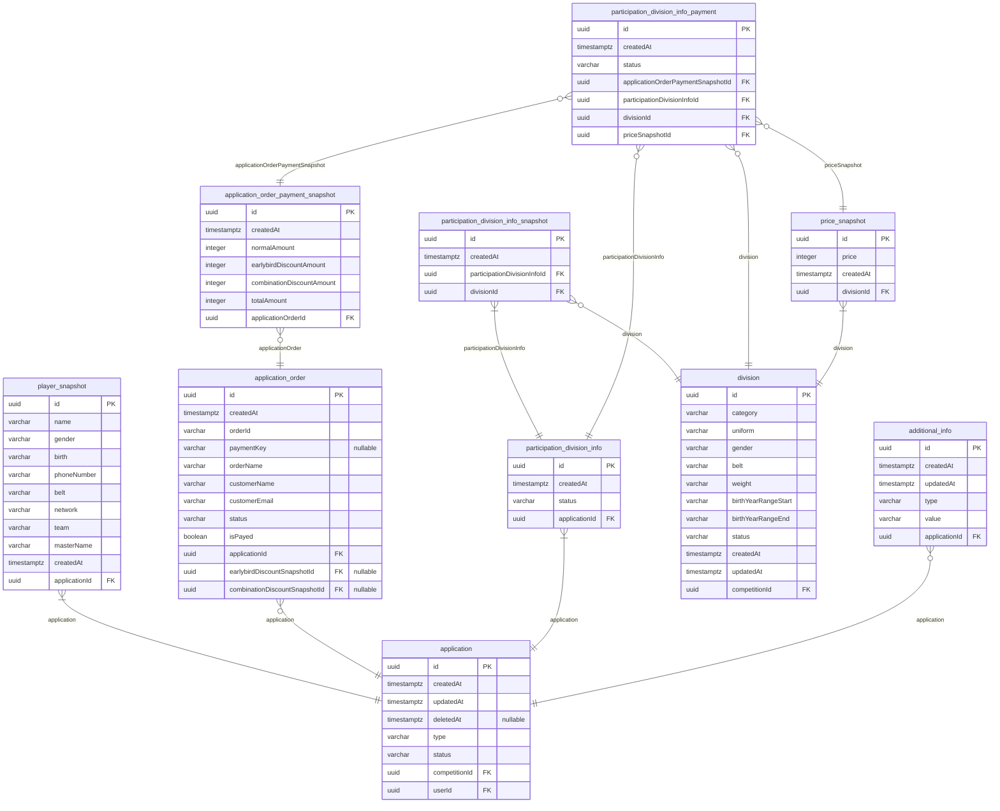
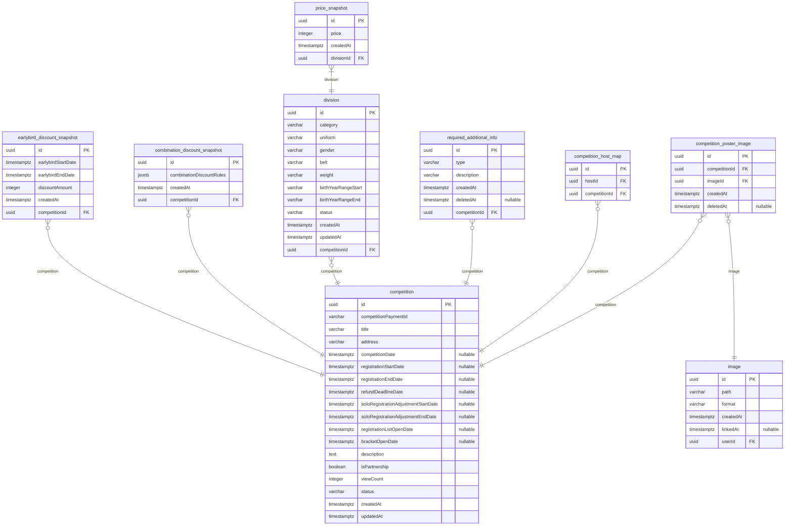
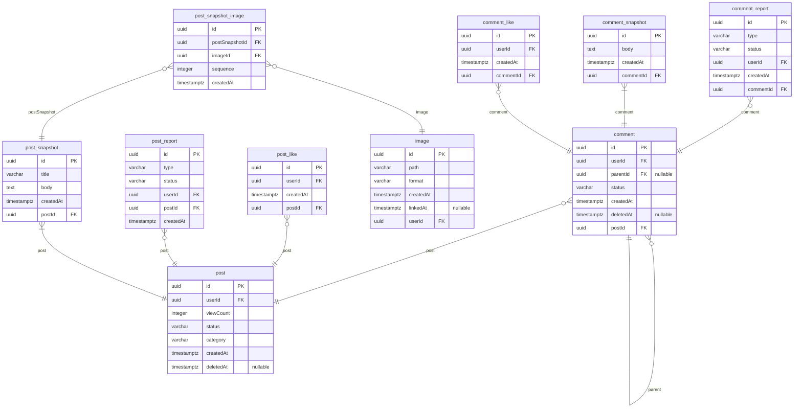
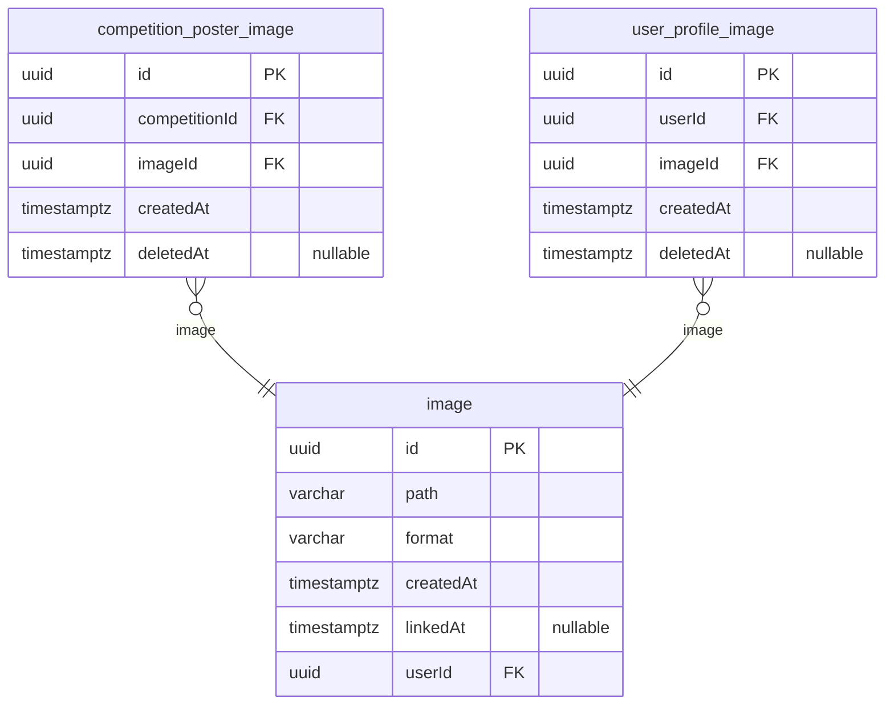
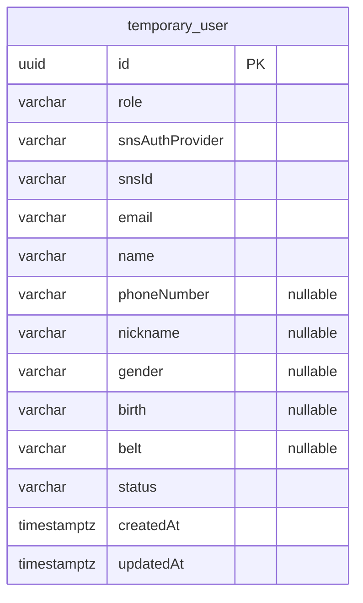

# NAJUHA V2 ERD

> Generated by [`typeorm-markdown-generator`](https://github.com/hermin9804/typeorm-markdown-generator)

## Table of Contents

- [User](#user)
- [Application](#application)
- [Competition](#competition)
- [Post](#post)
- [Image](#image)
- [TemporaryUser](#temporaryuser)

## User

### `policy`

Policy.   
   
- 같은 타입의 약관수정이 필요할때는 업데이트가 아닌 새로운 약관을 생성합니다.   
- 새로운 약관이 생성될 때마다 버전을 올립니다.   
@namespace User

**Properties**

  - `id`: UUID v7.
  - `version`: 약관의 버전.
  - `type`
    > 약관의 종류.
    > - TERMS_OF_SERVICE: 서비스 이용 약관.
    > - PRIVACY: 개인정보 처리 방침.
    > - REFUND: 환불 정책.
    > - ADVERTISEMENT: 광고정책.
  - `isMandatory`
    > 약관동의 필수여수.
    > - true: 필수.
    > - false: 선택.
  - `title`
    > 약관의 제목.
    > - ex) 서비스 이용 약관, 개인정보 처리 방침, 환불 정책.
  - `content`
    > 약관의 내용.
    > - ex) 서비스 이용 약관, 개인정보 처리 방침, 환불 정책.
  - `createdAt`

### `policy_consent`

PolicyConsent   
   
- 사용자가 동의한 약관 정보.   
@namespace User

**Properties**

  - `id`: UUID v7.
  - `createdAt`: 약관 동의 날짜.
  - `userId`
  - `policyId`: - policyId.

### `user_profile_image`

UserProfileImage.   
   
사용자 프로필 이미지 정보.   
- ImageEntity 와 UserEntity 를 연결하는 엔티티.   
- 실제 이미지 정보는 ImageEntity 에 저장되어 있습니다.   
   
@namespace User   
@erd Image

**Properties**

  - `id`: UUID v7.
  - `userId`: userId
  - `imageId`
    > imageId
    > - u-9-1 createImage 로 생성된 image의 id
  - `createdAt`
  - `deletedAt`

### `user`

User.   
   
사용자 정보.   
@namespace User

**Properties**

  - `id`: UUID v7.
  - `role`
    > User 역할. User의 접근 권한을 나타냅니다.
    > - ADMIN: 관리자 권한.
    > - HOST: 대회 주최자 권한.
    > - USER: 일반 User 권한.
    > - TEMPORARY_USER: 회원가입을 완료하지 않은 User 권한.
  - `snsAuthProvider`
    > SNS 공급자. User가 로그인하는데 사용한 SNS 플랫폼을 나타냅니다.
    > - KAKAO: 카카오.
    > - NAVER: 네이버.
    > - GOOGLE: 구글.
    > - APPLE: 애플.
  - `snsId`: SNS ID. 소셜 로그인을 위한 고유 식별자입니다.
  - `email`: User 이메일 주소.
  - `name`
    > User 이름.
    > - 컬럼길이는 256으로 설정하였으나, 입력값 유효성검사는 64자 이내로 설정하도록 합니다.
    > - User 이름은 한글, 영문, 숫자만 입력 가능합니다.
  - `phoneNumber`
    > User 전화번호.
    > - 전화번호가 저장되어 있으면 인증된 전화번호 입니다.
    > - ex) 01012345678.
  - `nickname`
    > User 별명.
    > - 영문, 한글, 숫자만 입력 가능합니다.
  - `gender`: User 성별.
  - `birth`: User 생년월일 (BirtDate YYYYMMDD).
  - `belt`: User 주짓수 벨트.
  - `status`
    > User 상태.
    > - ACTIVE: 활성.
    > - INACTIVE: 비활성.
  - `createdAt`
  - `updatedAt`

## Application

### Indexes

| Table | Index Name | Columns | Unique | Spatial | Where |
|-------|-------------|---------|--------|---------|-----------|
| player_snapshot | IDX_PlayerSnapshot_applicationId | applicationId | false | false |  |
| application_order | IDX_ApplicationOrder_applicationId | applicationId | false | false |  |
| application_order_payment_snapshot | IDX_ApplicationOrderPaymentSnapshot_applicationOrderId | applicationOrderId | false | false |  |
| participation_division_info_snapshot | IDX_ParticipationDivisionInfoSnapshot_participationDivisionInfoId | participationDivisionInfoId | false | false |  |
| participation_division_info | IDX_ParticipationDivisionInfo_applicationId | applicationId | false | false |  |
| participation_division_info_payment | IDX_ParticipationDivisionInfoPayment_applicationOrderPaymentSnapshotId | applicationOrderPaymentSnapshotId | false | false |  |
| price_snapshot | IDX_PriceSnapshot_divisionId | divisionId | false | false |  |
| division | IDX_Division_competitionId | competitionId | false | false |  |
| additional_info | IDX_AddtionalInfo_applicationId | applicationId | false | false |  |
| application | IDX_Application_userId_createdAt | userId, createdAt | false | false |  |

### `player_snapshot`

PlayerSnapshot.   
   
주짓수 대회 참가자의 정보 스냅샷.   
- 대회 참가자의 정보를 스냅샷하여 저장합니다.   
- 대회 참가자의 정보는 변경될때마다 스냅샷을 생성합니다. (변경 이력 추적)   
@namespace Application

**Properties**

  - `id`: UUID v7.
  - `name`: 선수 이름. (한글, 영문, 숫자, 공백 입력 가능합니다).
  - `gender`: 선수 성별.
  - `birth`: 선수 생년월일 (BirtDate YYYYMMDD).
  - `phoneNumber`: 선수 휴대폰 번호. ex) 01012345678.
  - `belt`: 선수 주짓수 벨트.
  - `network`: 주짓수 네트워크. (한글, 영문, 숫자, 공백 입력 가능합니다).
  - `team`: 소속 팀. (한글, 영문, 숫자, 공백 입력 가능합니다).
  - `masterName`: 관장님 성함.
  - `createdAt`
  - `applicationId`

### `application_order`

ApplicationOrder.   
   
참가신청 주문 정보.   
- 참가신청에 대한 주문 정보를 저장합니다.   
- 참가신청에 대해 결제 실패 등의 이유로 여려개의 주문이 발생할 수 있습니다.   
@namespace Application

**Properties**

  - `id`: UUID v7.
  - `createdAt`
  - `orderId`
    > - 주문번호(총 63자)
    > - `${applicationOrder.id}_${competition.competitionPaymentId}` 형태로 생성.
    > - 36자의 applicationOrder.id(uuidv7)와 26자의 competition.competitionPaymentId(ULID)를 조합하여 생성.
    > - ex) 123e4567-e89b-12d3-a456-426614174000_01ARYZ6S41MK3W7DMT3RZR9K9Z
    > 
    > Q. 왜 applicationOrder.id와 competition.competitionPaymentId를 조합하여 생성하나요?
    > A. 정산과정에서 동일한 대회의 주문 번호를 식별하기 위함입니다.
  - `paymentKey`
    > tosspayments에서 발급받은 결제키.
    > - 결제가 완료되면 발급받은 결제키를 저장합니다.
    > - 결제가 완료되지 않은 경우 null.
    > - 고유한 결제정보를 식별하기 위한 키입니다.
  - `orderName`
    > 주문명(총 100자)
    > - 신청한 대회의 title이 저장됩니다.
  - `customerName`: 주문자 이름(총 64자)
  - `customerEmail`: 주문자 이메일(총 320자)
  - `status`
    > 주문 상태.
    > - READY: 결제 대기중
    > - DONE: 결제 완료
    > - FAIL: 결제 실패
    > - PARTIAL_CANCELED: 부분 취소
    > - CANCELED: 전체 취소
  - `isPayed`: 결제 여부.
  - `applicationId`
  - `earlybirdDiscountSnapshotId`
  - `combinationDiscountSnapshotId`

### `application_order_payment_snapshot`

ApplicationOrderPaymentSnapshot.   
   
참가신청에 대한 결제 정보.   
@namespace Application

**Properties**

  - `id`: UUID v7.
  - `createdAt`: createdAt.
  - `normalAmount`: 할인이 적용되지 않은 총 금액 (원).
  - `earlybirdDiscountAmount`: 얼리버드 할인 규칙에의해 할인된 금액. (원).
  - `combinationDiscountAmount`: 조합할인 규칙에의해 할인된 금액. (원).
  - `totalAmount`
    > 할인이 적용된 최종금액. (원).
    > - 계산 방법 : normalAmount - earlybirdDiscountAmount - combinationDiscountAmount.
  - `applicationOrderId`: - application id.

### `participation_division_info_snapshot`

ParticipationDivisionInfoSnapshot.   
   
참가신청에 대한 부문 정보.   
- 참가신청에 대한 부문 정보가 변경경될때마다 스냅샷을 생성한다.   
- 결제 이후에만 스냅샷이 저장되고, 결제 이전에 참가 부문 수정시, Application자체를 새로 생성한다.   
- 해당 entity 를 포함하는 Application이 DONE 상태라면, 최초의 스냅샷이 결제정보로 사용된다.   
- 마지막 스냅샷이 현제의 참가 부문 정보를 나타낸다.   
@namespace Application

**Properties**

  - `id`: UUID v7.
  - `createdAt`
  - `participationDivisionInfoId`
  - `divisionId`: 유저가 참가할 부문 ID.

### `participation_division_info`

ParticipationDivisionInfo.   
   
참가신청에 대한 부문 정보 식별하는 Entity.   
- 참가신청에 대한 부문 정보가 변경경될때마다 하위 entity인 ParticipationDivisionInfoSnapshot을 생성한다.   
@namespace Application

**Properties**

  - `id`: UUID v7.
  - `createdAt`
  - `status`
    > 참가부문 정보 상태.
    > - READY: 결제 대기중
    > - DONE: 결제 완료
    > - CANCELED: 결제 취소
  - `applicationId`

### `participation_division_info_payment`

ParticipationDivisionInfoPayment.   
   
ParticipationDivisionInfo 에 대한 결제 정보.   
@namespace Application

**Properties**

  - `id`: UUID v7.
  - `createdAt`
  - `status`
    > 결제 상태.
    > - READY: 결제 대기중
    > - DONE: 결제 완료
    > - CANCELED: 결제 취소
  - `applicationOrderPaymentSnapshotId`
  - `participationDivisionInfoId`
  - `divisionId`
  - `priceSnapshotId`

### `additional_info`

AdditionalInfo.   
   
대회사가 참가자에게 요구하는 추가 정보. ex) 주소, 주민등록번호 등   
대회사가 요청하지 않은경우 추가 정보를 입력하지 않아도 된다.   
@namespace Application

**Properties**

  - `id`: UUID v7.
  - `createdAt`: createdAt.
  - `updatedAt`: updatedAt
  - `type`
    > type.
    > - SOCIAL_SECURITY_NUMBER: 주민등록번호
    > - ADDRESS: 주소
  - `value`
    > value. 각 type에 해당하는 값.
    > - SOCIAL_SECURITY_NUMBER: '123456-1234567'
    > - ADDRESS: '서울시 강남구 테헤란로 123'
  - `applicationId`: Application id.

### `application`

Application.   
   
대회 참가 신청 정보.   
@namespace Application

**Properties**

  - `id`: UUID v7.
  - `createdAt`
  - `updatedAt`
  - `deletedAt`
  - `type`
    > 본인신청과 대리신청을 구별하는 type.
    > - SELF: 본인 신청
    > - PROXY: 대리 신청
  - `status`
    > 대회 신청 상태.
    > - READY: 결제 대기중
    > - DONE: 결제 완료
    > - PARTIAL_CANCELED: 부분 취소
    > - CANCELED: 전체 취소
  - `competitionId`: 참가 대회 id
  - `userId`: 신청자 계정의 userId

## Competition

### Indexes

| Table | Index Name | Columns | Unique | Spatial | Where |
|-------|-------------|---------|--------|---------|-----------|
| earlybird_discount_snapshot | IDX_EarlybirdDiscountSnapshot_competitionId | competitionId | false | false |  |
| combination_discount_snapshot | IDX_CombinationDiscountSnapshot_competitionId | competitionId | false | false |  |
| price_snapshot | IDX_PriceSnapshot_divisionId | divisionId | false | false |  |
| division | IDX_Division_competitionId | competitionId | false | false |  |
| required_additional_info | IDX_RequiredAdditionalInfo_competitionId | competitionId | false | false |  |
| competition_host_map | IDX_CompetitionHostMap_competitionId | competitionId | false | false |  |
| competition | IDX_Competition_status | status | false | false |  |
| competition | IDX_Competition_competitionDate | competitionDate | false | false |  |

### `earlybird_discount_snapshot`

EarlybirdDiscountSnapshot.   
   
얼리버드 할인 스냅샷.   
- 얼리버드 할인 규칙이 변경될때마다 스냅샷을 생성한다.   
@namespace Competition

**Properties**

  - `id`: UUID v7.
  - `earlybirdStartDate`: 얼리버드 할인 시작일.
  - `earlybirdEndDate`: 얼리버드 할인 마감일.
  - `discountAmount`
    > 얼리버드 할인 가격.
    > - ex) 10000.
    > - 단위 : 원.
    > - 음수 값은 허용하지 않습니다.
  - `createdAt`
  - `competitionId`

### `combination_discount_snapshot`

CombinationDiscountSnapshot.   
   
부문 조합 할인 스냅샷.   
- 조합 할인 규칙이 변경될때마다 스냅샷을 생성한다.   
@namespace Competition

**Properties**

  - `id`: UUID v7.
  - `combinationDiscountRules`: 조합 할인 규칙.
  - `createdAt`
  - `competitionId`

### `price_snapshot`

PriceSnapshot.   
   
대회 부문이 가격 스냅샷.   
- 대회 부문의 가격이 변경될때마다 스냅샷을 생성한다.   
@namespace Competition   
@erd Application

**Properties**

  - `id`: UUID v7.
  - `price`: price, (원).
  - `createdAt`
  - `divisionId`

### `division`

Division.   
   
- 대회의 부문 정보.   
- 대회의 부문의 가격 정보는 PriceSnapshot Entity를 통해 관리합니다.   
- 가격이 수정될때마다 PriceSnapshot Entity에 스냅샷을 생성합니다.   
@namespace Competition   
@erd Application

**Properties**

  - `id`: UUID v7.
  - `category`
    > 부문 카테고리.
    > - ex) '초등부', '중등부', '어덜트'.
  - `uniform`: 유니폼.
  - `gender`: 부문 성별.
  - `belt`
    > 주짓수벨트.
    > - ex) '화이트', '블루', '퍼플', '브라운', '블랙'.
  - `weight`
    > 체급.
    > - weight type: '-45', '+45', '-60.5', '+60.5'
    > - absolute type: '-45_ABSOLUTE', '+45_ABSOLUTE', '-60.5_ABSOLUTE', '+60.5_ABSOLUTE', 'ABSOLUTE'
  - `birthYearRangeStart`: 출생년도 범위 시작. YYYY.
  - `birthYearRangeEnd`: 출생년도 범위 끝. YYYY.
  - `status`
    > 활성 상태.
    > - ACTIVE: 해당 부문에 신청 가능. (USER 에게 노출됨.)
    > - INACTIVE: 해당 부문에 신청 불가능. (USER 에게 노출되지 않음.)
  - `createdAt`
  - `updatedAt`
  - `competitionId`

### `required_additional_info`

RequiredAdditionalInfo.   
   
대회신청시 추가 정보 입력 규칙.   
- 대회사가 요청한경우에만 해당 Entity를 생성합니다.   
@namespace Competition

**Properties**

  - `id`: UUID v7.
  - `type`
    > 추가정보 타입가
    > 
    > - SOCIAL_SECURITY_NUMBER : 주민등록번호
    > - ADDRESS : 주소
  - `description`
    > 추가정보 설명.
    > - 추가 정보를 수집하는 이유등을 설명합니다등
  - `createdAt`
  - `deletedAt`
  - `competitionId`

### `competition_host_map`

Competition Host Map Entity   
@namespace Competition

**Properties**

  - `id`: UUID v7.
  - `hostId`: 주최자 User ID.
  - `competitionId`: 주체 대회 ID.

### `competition_poster_image`

CompetitionPosterImage.   
   
- 실제 이미지에 대한 정보는 Image Entity를 통해 관리합니다.   
- 해당 Entity는 대회 포스터 이미지와 대회를 매핑하는 역할을 합니다.   
@namespace Competition   
@erd Image

**Properties**

  - `id`: UUID v7.
  - `competitionId`: competitionId
  - `imageId`
    > imageId
    > - u-9-1 createImage 로 생성된 image의 id
  - `createdAt`
  - `deletedAt`

### `competition`

Competition.   
   
대회 정보.   
@namespace Competition

**Properties**

  - `id`: UUID v7.
  - `competitionPaymentId`
    > 대회 결제 ID.
    > - 결제 ID는 26자리 ULID 형식입니다.
    > - 각 대회마다 고유한 결제 ID를 가집니다.
    > - 해당 대회신청을 결제할때 필요한 orderId에 포함됩니다. `${orderId}_${competitionPaymentId}` (63자)
    > - tosspayments에서 해당 대회의 결제 정보를 조회할때 사용됩니다.
  - `title`: 대회명.
  - `address`: 대회가 열리는 위치 (도로명 주소).
  - `competitionDate`: 대회 날짜.
  - `registrationStartDate`: 참가 신청 시작일.
  - `registrationEndDate`: 참가 신청 마감일.
  - `refundDeadlineDate`: 환불 가능 기간 마감일.
  - `soloRegistrationAdjustmentStartDate`
    > 단독 참가자의 부문 조정 시작일.
    > - 부문에 참가자가 한 명만 있는 경우, 해당 참가자를 다른 체급이나 부문으로 조정할 수 있는 기간의 시작을 나타냅니다.
  - `soloRegistrationAdjustmentEndDate`: 단독 참가자의 부문 조정 마감일.
  - `registrationListOpenDate`: 참가자 명단 공개일.
  - `bracketOpenDate`: 대진표 공개일.
  - `description`: 대회 상세 정보.
  - `isPartnership`: 협약 대회 여부.
  - `viewCount`: 조회수.
  - `status`
    > 대회의 상태.
    > - ACTIVE: 활성화된 대회 유저에게 노출, 참가 신청 가능.
    > - INACTIVE: 비활성화된 대회 유저에게 노출되지 않음, 참가 신청 불가능.
  - `createdAt`
  - `updatedAt`

## Post

### `comment_report`

CommentReport.   
   
댓글의 신고정보를 담는 Entity입니다.   
신고 횟수가 10회 이상이면 해당 댓글이 `INACTIVE` 상태로 변경되고, 유저에게 노출되지 않습니다.   
동일한 유저가 동일한 댓글을 여러 번 신고할 수 없습니다. (중복신고 불가능)   
   
@namespace Post

**Properties**

  - `id`: UUID v7.
  - `type`
    > 신고 타입.
    > - SPAM_CLICKBAIT: 낚시 / 놀람 / 도배
    > - COMMERCIAL_ADVERTISING: 상업적 광고 및 판매
    > - SEXUAL_CONTENT: 음란성 / 선정적
    > - ABUSE_HARASSMENT: 욕설/비하
    > - POLITICAL_DISPARAGEMENT: 정당/정치인 비하 및 선거운동
    > - IMPERSONATION_FRAUD: 유출/사칭/사기
    > - ILLEGAL_DISTRIBUTION: 불법촬영물 등의 유통
    > - RELIGIOUS_PROSELYTIZING: 종교 포교 시도
    > - INAPPROPRIATE_CONTENT: 게시판 성격에 부적절함
  - `status`
    > 신고 상태.
    > `ACCEPTED`상태의 신고가 10회 이상이면 해당 댓글이 `INACTIVE` 상태로 변경됩니다.
    > - `ACCEPTED`: 신고 승인.
    > - `REJECTED`: 신고 거부.
  - `userId`: 신고자 UserId.
  - `createdAt`: 신고일자.
  - `commentId`: 신고된 댓글의 Id.

### `comment_snapshot`

CommentSnapshot.   
   
댓글의 스냅샷 정보를 담는 Entity입니다.   
`comment`에서 언급한 것처럼 증거를 보관하고 사기를 방지하기 위해 댓글 레코드에서 댓글 내용을 분리하여 보관합니다.   
   
@namespace Post

**Properties**

  - `id`: UUID v7.
  - `body`: 댓글 내용.
  - `createdAt`: 댓글 작성일자.
  - `commentId`: 댓글 Id.

### `comment`

Comment, CommentReply.   
댓글 or 대댓글을 식별하는 최상위 엔티티로서 개별 댓글의 메타데이터를 담고 있습니다.   
   
댓글의 내용(body) `comment`에 존재하지 않고, `comment_snapshot`에 저장되어 있습니다.   
`comment`와 `comment_snapshot`는 1:N 관계로 연결되어 있는데, 이는 댓글이 수정될때마다 새로운 스냅샷 레코드가 생성되기 때문입니다.   
   
댓글이 수정될때마다 새로운 스냅샷 레코드가 생성되는 이유는 증거를 보존 및 추적하기 위함입니다. 온라인 커뮤니티의 특성상 참여자 간에는 항상 분쟁의 위험이 존재합니다.   
그리고 분쟁은 글이나 댓글을 통해 발생할 수 있으며, 기존 댓글을 수정하여 상황을 조작하는 등의 행위를 방지하기 위해 이러한 구조로 설계되었습니다. 즉, 증거를 보관하고 사기를 방지하기 위한 것입니다.   
   
대댓글은 부모 댓글의 `id`를 `parentId`에 저장하여 관계를 맺습니다. 대댓글의 depth는 1로 제한되어 있습니다. 즉 대댓글의 대댓글은 생성할 수 없습니다.   
   
@namespace Post

**Properties**

  - `id`: UUID v7.
  - `userId`: 댓글 작성자 UserId.
  - `parentId`
    > 부모 댓글 Id.
    > - 댓글의 경우 `null`을 저장합니다.
    > - 대댓글의 경우 부모 댓글의 `id`를 저장합니다.
  - `status`
    > 댓글 상태. default: `ACTIVE`.
    > - `ACTIVE`: 유저에게 노출.
    > - `INACTIVE`: 유저에게 노출되지 않음.
    > 관리자의 판단 하에 `INACTIVE`로 변경될 수 있습니다.
    > 신고 회수가 10회 이상이면 자동으로 `INACTIVE` 처리됩니다. 관리자의 판단 하에 `ACTIVE`로 변경될 수 있습니다.
  - `createdAt`: 댓글 작성일자.
  - `deletedAt`: 댓글 삭제일자.
  - `postId`: 게시글 Id.

### `comment_like`

CommentLike.   
   
댓글 좋아요 정보를 담는 Entity입니다.   
동일한 유저가 동일한 댓글에 여러 번 좋아요를 누를 수 없습니다. (중복 좋아요 불가능)   
   
@namespace Post

**Properties**

  - `id`: UUID v7.
  - `userId`: 좋아요를 누른 UserId.
  - `createdAt`: 좋아요 누른 일자.
  - `commentId`: 좋아요를 누른 댓글의 Id.

### `post_like`

PostLike.   
   
게시글 좋아요 정보를 담는 Entity입니다.   
동일한 유저가 동일한 게시글에 여러 번 좋아요를 누를 수 없습니다. (중복 좋아요 불가능)   
   
@namespace Post

**Properties**

  - `id`: UUID v7.
  - `userId`: 좋아요를 누른 UserId.
  - `createdAt`: 좋아요 누른 일자.
  - `postId`: 좋아요를 누른 게시글의 Id.

### `post_report`

PostReport.   
   
게시글의 신고정보를 담는 Entity입니다.   
신고 횟수가 10회 이상이면 해당 게시글이 `INACTIVE` 상태로 변경되고, 유저에게 노출되지 않습니다.   
동일한 유저가 동일한 게시글을 여러 번 신고할 수 없습니다. (중복신고 불가능)   
   
@namespace Post

**Properties**

  - `id`: UUID v7.
  - `type`
    > 신고 타입.
    > - SPAM_CLICKBAIT: 낚시 / 놀람 / 도배
    > - COMMERCIAL_ADVERTISING: 상업적 광고 및 판매
    > - SEXUAL_CONTENT: 음란성 / 선정적
    > - ABUSE_HARASSMENT: 욕설/비하
    > - POLITICAL_DISPARAGEMENT: 정당/정치인 비하 및 선거운동
    > - IMPERSONATION_FRAUD: 유출/사칭/사기
    > - ILLEGAL_DISTRIBUTION: 불법촬영물 등의 유통
    > - RELIGIOUS_PROSELYTIZING: 종교 포교 시도
    > - INAPPROPRIATE_CONTENT: 게시판 성격에 부적절함
  - `status`
    > 신고 상태.
    > `ACCEPTED`상태의 신고가 10회 이상이면 해당 게시글이 `INACTIVE` 상태로 변경됩니다.
    > - `ACCEPTED`: 신고 승인.
    > - `REJECTED`: 신고 거부.
  - `userId`: 신고자 UserId.
  - `postId`: 신고된 게시글의 Id.
  - `createdAt`: 신고일자.

### `post_snapshot_image`

PostSnapshotImage.   
   
@namespace Post

**Properties**

  - `id`: UUID v7.
  - `postSnapshotId`: postSnapshotId.
  - `imageId`
    > imageId.
    > - u-9-1 createImage 로 생성된 image의 id
  - `sequence`
    > sequence.
    > - 게시물 이미지의 순서.
    > - 0부터 시작.
  - `createdAt`

### `post_snapshot`

PostSnapshot.   
   
게시글의 스냅샷 정보를 담는 Entity입니다.   
`post`에서 언급한 것처럼 증거를 보관하고 사기를 방지하기 위해 게시글 레코드에서 게시글 내용을 분리하여 보관합니다.   
   
@namespace Post

**Properties**

  - `id`: UUID v7.
  - `title`: 게시글 제목.
  - `body`: 게시글 내용.
  - `createdAt`: 게시글 작성일자.
  - `postId`: 게시글 Id.

### `post`

Post.   
게시글을 식별하는 최상위 엔티티로서 개별 게시글의 메타데이터를 담고 있습니다.   
   
게시글의 필수 요소 `title`, `body` 등은 `post`에 존재하지 않고, `post_snapshot`에 저장되어 있습니다.   
`post`와 `post_snapshot`는 1:N 관계로 연결되어 있는데, 이는 글이 수정될때마다 새로운 스냅샷 레코드가 생성되기 때문입니다.   
   
게시글이 수정될때마다 새로운 스냅샷 레코드가 생성되는 이유는 증거를 보존 및 추적하기 위함입니다. 온라인 커뮤니티의 특성상 참여자 간에는 항상 분쟁의 위험이 존재합니다.   
그리고 분쟁은 글이나 댓글을 통해 발생할 수 있으며, 기존 글을 수정하여 상황을 조작하는 등의 행위를 방지하기 위해 이러한 구조로 설계되었습니다. 즉, 증거를 보관하고 사기를 방지하기 위한 것입니다.   
   
@namespace Post

**Properties**

  - `id`: UUID v7.
  - `userId`: 게시글 작성자 UserId.
  - `viewCount`: 게시글 조회수.
  - `status`
    > 게시글 상태. default: `ACTIVE`.
    > - `ACTIVE`: 유저에게 노출.
    > - `INACTIVE`: 유저에게 노출되지 않음.
    > 관리자의 판단 하에 `INACTIVE`로 변경될 수 있습니다.
    > 신고 회수가 10회 이상이면 자동으로 `INACTIVE` 처리됩니다. 관리자의 판단 하에 `ACTIVE`로 변경될 수 있습니다.
  - `category`
    > Post category.
    > - FREE: 자유 게시판.
    > - COMPETITION: 대회 게시판.
    > - SEMINAR: 세미나 게시판.
    > - OPEN_MAT: 오픈 매트 게시판.
  - `createdAt`: 게시글 작성일자.
  - `deletedAt`: 게시글 삭제일자.

## Image

### `image`

Image.   
   
이미지 정보.   
- bucket에 저장되는 이미지 정보.   
- UserImage, CompetitionPosterImage, PostImage 등 에 매핑되어 사용됩니다.   
- 이미지는 10분 이후에도 UserImage, CompetitionPosterImage, PostImage 등 에 매핑되지 않으면 삭제됩니다.   
- 이미지가 매핑된다면 linkedAt 에 매핑된 시간이 저장됩니다.   
   
@namespace Image   
@erd Competition   
@erd Post   
@erd User

**Properties**

  - `id`
    > UUID v7.
    > - s3 bucket에 저장되는 이미지의 key로 사용됩니다.
    > - `${bucketHost}/${bucketName}/${path}/${id}` 로 접근 가능합니다.
    > - ex) http://localhost:9000/najuha-v2-bucket/competition/019000fb-11c3-7766-ad55-17c0c2b18cae
  - `path`
    > s3 bucket에 저장되는 이미지의 경로
    > - user 프로필 이미지를 생성하는 경우: `user-profile` 로 설로
    > - competition 이미지를 생성하는 경우: `competition` 로 설정
    > - post 이미지를 생성하는 경우: `post` 로 설정
  - `format`
    > image format.
    > - 'image/jpeg'
    > - 'image/png'
    > - 'image/webp';
  - `createdAt`
    > createdAt.
    > - 이미지가 생성된 시간
  - `linkedAt`
    > linkedAt.
    > - 이미지를 소유한 entity에 FK로 연결된 시간.
    > - null 이면 연결되지 않은 이미지.
    > - createdAt + 10분 이후에도 연결되지 않은 이미지는 주기적으로 삭제됩니다.
  - `userId`
    > userId.
    > - 이미지를 생성한 계정의 userId.

## TemporaryUser

### `temporary_user`

TemporaryUser.   
   
회원가입이 완료되지 않은 사용자.   
- 회원가입이 완료되면 User로 이동한다.   
@namespace TemporaryUser

**Properties**

  - `id`
  - `role`
  - `snsAuthProvider`
  - `snsId`
  - `email`
  - `name`
  - `phoneNumber`
  - `nickname`
  - `gender`
  - `birth`
  - `belt`
  - `status`
  - `createdAt`
  - `updatedAt`

